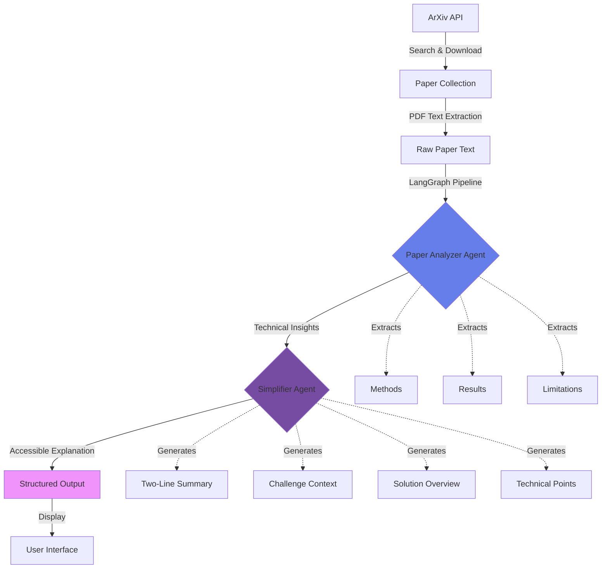

## Radar Architecture

### Agent Workflow


### System Components

#### 1. Data Ingestion Layer
- **ArXiv API Client**: Searches and retrieves papers by category
- **PDF Processor**: Extracts text and identifies sections using PyMuPDF
- **Data Storage**: Caches processed papers to avoid re-processing

#### 2. Agent Pipeline (LangGraph)
- **Paper Analyzer Agent**: Extracts technical insights from raw paper text
- **Simplifier Agent**: Translates technical content into accessible explanations
- **State Management**: Maintains data flow between agents

#### 3. Output Layer
- **Structured Data**: JSON format with all extracted insights
- **User Interface**: (In development) Gradio-based web application

### Data Flow
```
Raw Paper (117k chars) 
    ↓
Paper Analyzer (60s processing)
    ↓
Technical Summary + Methods + Results + Limitations
    ↓
Simplifier (30s processing)
    ↓
Accessible Summary + Challenge + Solution + Key Points
```

### Technology Stack

| Component | Technology | Purpose |
|-----------|-----------|---------|
| Orchestration | LangGraph | Agent workflow management |
| LLM | Claude Sonnet 4 | Natural language processing |
| PDF Processing | PyMuPDF | Text extraction |
| Data Source | ArXiv API | Research paper retrieval |
| Storage | JSON/CSV | Processed data persistence |